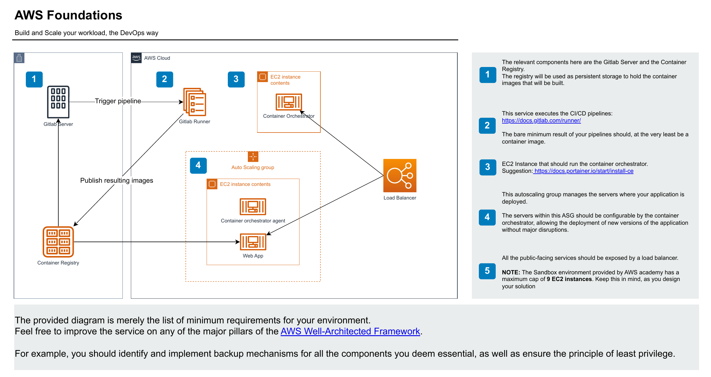

# AWS – Build and Scale the DevOps Way

Infrastructure on AWS provisioned with **Terraform**, configured with **Ansible**, and with automatic deployment of a containerized application through **Nomad** and a **GitLab CI/CD** pipeline.

## Architecture

The project implements the following environment (diagram from the assignment):



| #   | Diagram component      | Implementation in this project                              |
| --- | ---------------------- | ----------------------------------------------------------- |
| 1   | GitLab Server          | GitLab (`gitlab.estig.ipb.pt`) + Container Registry on **Docker Hub** |
| 2   | GitLab Runner          | EC2 with registered runner (`aws/runner.tf`)                |
| 3   | Container Orchestrator | **Nomad Server** (`aws/nomad_server.tf`)                    |
| 4   | Auto Scaling Group     | Nomad clients in an ASG (`aws/asg.tf`)                      |
| 5   | Load Balancer          | Network Load Balancer (`aws/aws_lb.tf`) + No-IP DNS         |

SSH access to the private instances is done through a **Bastion Host** (`aws/bastion_host.tf`).

## Prerequisites

- [Terraform](https://www.terraform.io/) >= 1.x
- [AWS CLI](https://aws.amazon.com/cli/) configured (`aws configure`)
- [Ansible](https://www.ansible.com/)
- A [No-IP](https://www.noip.com) account (dynamic DNS)

> **No secrets are stored in the repository.** Sensitive values are provided in `terraform.tfvars` (ignored by Git).

## Steps

### 1. Configure variables

```bash
cd aws
cp terraform.tfvars.example terraform.tfvars
# edit terraform.tfvars with your own values
```

Generate the SSH key pair and paste the **public** key into `ssh_public_key`:

```bash
ssh-keygen -t ed25519 -f ~/.ssh/my-key-aws
```

### 2. Provision the infrastructure (Terraform)

```bash
terraform init
terraform plan
terraform apply
```

### 3. Configure SSH access

Generate `~/.ssh/config` from the Terraform outputs:

```bash
./connect.sh
```

You can then connect via the Bastion: `ssh bastion`, `ssh nomad-server`, `ssh runner`.

### 4. Configure the servers (Ansible)

Installs and configures Nomad, Nginx and TLS:

```bash
cd ../ansible
ansible-playbook -i inventory.ini playbooks/site.yml --ask-vault-pass
```

> `--ask-vault-pass` is required because the TLS certificates are protected with **Ansible Vault** (`group_vars/all/vault.yml`).

### 5. Deploy the application (GitLab CI/CD)

Set the `NOMAD_ADDR` variable in GitLab (the Nomad Server address) and push:

```bash
git push
```

The pipeline (`.gitlab-ci.yml`):
1. **builds** the Docker images (webapp + nomad-runner);
2. **publishes** them to Docker Hub;
3. runs `nomad job run nomad-jobs/webapp.hcl` to deploy.

### 6. Update the dynamic DNS (No-IP)

Point the No-IP domain to a healthy Load Balancer IP:

```bash
cd ../aws
export NOIP_HOST="your_host.myftp.org"
export NOIP_USER="your_email"
export NOIP_PASS="your_password"
./scripts/update-noip.sh
```

## Project structure

```text
aws/            Terraform infrastructure (VPC, bastion, nomad, ASG, NLB, runner)
ansible/        Configuration playbooks (Nomad, Nginx, TLS) + Vault
nomad-jobs/     Nomad job definition for the application (webapp.hcl)
nomad-runner/   Docker image with the Nomad CLI used by the pipeline
app/            Dockerfile and web application configuration
docs/           Documentation and architecture diagram
```

## Notes

- The Docker images use the `maciel04` namespace (public). To replicate with your own account, replace `maciel04` in `nomad-jobs/webapp.hcl` and `.gitlab-ci.yml`.
- The AWS Academy Sandbox environment has a limit of **9 EC2 instances** — keep this in mind when tuning the ASG.
